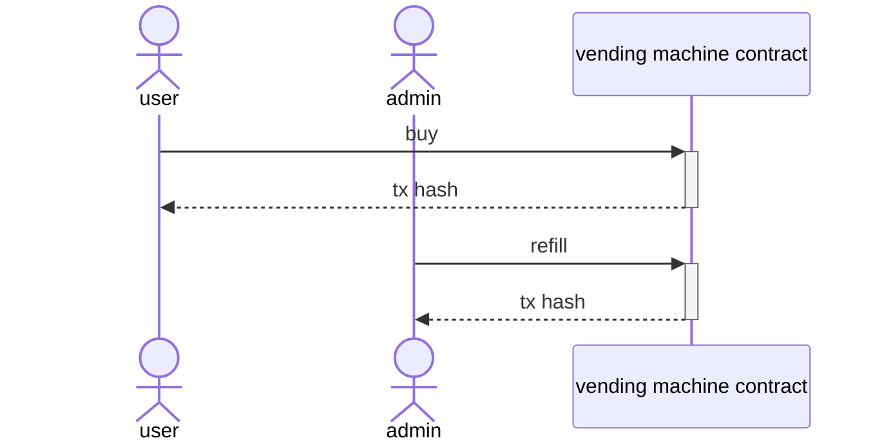

# mermaid
mermaid라는 단어를 '''mermaid 이런식으로 코드를 넣는 첫줄 옆에 넣어주게 되면 아래와 같이 리드미에서 바로 mermaid를 보여줄 수 있습니다.




URL
https://mermaid.live/edit#pako:eNptUTFuwzAM_ArBtfEHNGTq2qlboYWV6FiARbkyVTQI8vfSVZ0EaCVA4B2PB-J0wVAio8OVPxpL4OdEp0rZC9ihoKVCW7k-Yoo5SScWqppCWkgUQhGtpgBa4ZMlJjlBpjAl4VuvT22GMByPT_cZB-_t3Ls3bjDJ0MUO9AsmWqffPbYN_jhUHtM8_2vSBx5c7ndT72_HeMDMNVOKlstlYzzqxJk9Oisjj9Rm9ejlalJqWl7PEtBpbXzAtkTSPcadtIDeSjE40rwa5pgsyZce_c8PXL8BJcaClg

# Truffle & web3 javascript 기본예제

1. truffle 설치

```
sudo npm install -g truffle --save
```

2. 버전체크
```
hyunkicho@Hyunkiui-MacBookPro tutorial_truffle % truffle version                   
Truffle v5.7.0 (core: 5.7.0)
Ganache v7.5.0
Solidity v0.5.16 (solc-js)
Node v16.14.2
Web3.js v1.7.4
```

3. 기본 예제 생성

```
hyunkicho@Hyunkiui-MacBookPro tutorial_truffle % mkdir MetaCoin
cd MetaCoin

hyunkicho@Hyunkiui-MacBookPro MetaCoin % truffle unbox metacoin


Starting unbox...
=================

✓ Preparing to download box
✓ Downloading
✓ Cleaning up temporary files
✓ Setting up box

Unbox successful, sweet!

Commands:

  Compile contracts: truffle compile
  Migrate contracts: truffle migrate
  Test contracts:    truffle test
```

4. 배포 스크립트 작성
2_deploy_vendingMachine.js 파일 참고

5. 배포 진행

컴파일만 하는 경우
```
truffle compile
```

임의의 로컬 네트워크를 생성하고 그 안에서 배포를 원할 시
```
truffle develop
truffle(develop)> migrate
```

기본 설정으로 배포를 해보고 싶은 경우
```
truffle migrate
```

config 파일 수정해 보기
```
  networks: {
    development: {
      host: "127.0.0.1",     // Localhost (default: none)
      port: 8545,            // Standard Ethereum port (default: none)
      network_id: "*",       // Any network (default: none)
     },
    ganache: {
      host: "127.0.0.1",
      port: 7545,
      network_id: "*"
    }
  },
```

ganache에 배포하길 원할 시 다음과 같이 실행
```
truffle migrate --network ganache
```

6. 1번 파일만 배포하길 원할 시
```
truffle migrate --f 1 --to 1
```

7. test 실행
```
truffle test ./test/vendingMachine.js
```

8. 조회/ 트랜잭션 스크립트 실행해 보기

각 파일의 input 값 수정해 준 후 스크립트 실행

조회의 경우
```
node scripts/cupcakeBalances.js 
```

트랜잭션 전송의 경우
```
node scripts/purchase.js
```

9. 이벤트 로그 조회해보기

```
node scripts/purchaseEvent.js 
```

# Hardhat & ethers typescript 기본예제

1. 설치
```
npm install --save-dev hardhat
```

2. hardhat 실행 후 typesctipt 선택

```
npx hardhat
888    888                      888 888               888
888    888                      888 888               888
888    888                      888 888               888
8888888888  8888b.  888d888 .d88888 88888b.   8888b.  888888
888    888     "88b 888P"  d88" 888 888 "88b     "88b 888
888    888 .d888888 888    888  888 888  888 .d888888 888
888    888 888  888 888    Y88b 888 888  888 888  888 Y88b.
888    888 "Y888888 888     "Y88888 888  888 "Y888888  "Y888

👷 Welcome to Hardhat v2.9.9 👷‍

? What do you want to do? …
  Create a JavaScript project
  Create a TypeScript project
❯ Create an empty hardhat.config.js
  Quit
```

3. 배포하기
```
npx hardhat run scripts/deploy.ts
```

4. 테스트하기
```
npx hardhat test
```

5. hardhat 로컬 네트워크 실행하기
```
npx hardhat node
```
config 파일 로컬 네트워크에 연결시키게 변경
```
  networks: {
    hardhat: {},
    local: {
      url:'http://127.0.0.1:8545/',
      accounts: ['0xac0974bec39a17e36ba4a6b4d238ff944bacb478cbed5efcae784d7bf4f2ff80']
    },
  },
```


6. 배포하고 상호작용하기
```
npx hardhat run scripts/deploy.ts --network local
npx hardhat run scripts/purchase.ts --network local
npx hardhat run scripts/cupcakeBalance.ts --network local
npx hardhat run scripts/purchaseEvent.ts --network local
```

7. 테스트 코드 커버리지 모듈 설치
```
npm install --save-dev solidity-coverage
```

8. 테스트 코드 커버리지 실행 시
```
hyunkicho@192 tutorial_hardhat % npx hardhat coverage

Version
=======
> solidity-coverage: v0.8.2

Instrumenting for coverage...
=============================

> VendigMachine.sol

Compilation:
============

Generating typings for: 1 artifacts in dir: typechain-types for target: ethers-v5
Successfully generated 6 typings!
Compiled 1 Solidity file successfully

Network Info
============
> HardhatEVM: v2.12.4
> network:    hardhat


  Lock
    VendingMachine
      ✔ should make 100 cupcake at constructor (151ms)
      ✔ should send cupcakes correctly after purchase
      ✔ should refill cupcakes correctly


  3 passing (192ms)

--------------------|----------|----------|----------|----------|----------------|
File                |  % Stmts | % Branch |  % Funcs |  % Lines |Uncovered Lines |
--------------------|----------|----------|----------|----------|----------------|
 contracts/         |      100 |       50 |      100 |      100 |                |
  VendigMachine.sol |      100 |       50 |      100 |      100 |                |
--------------------|----------|----------|----------|----------|----------------|
All files           |      100 |       50 |      100 |      100 |                |
--------------------|----------|----------|----------|----------|----------------|

> Istanbul reports written to ./coverage/ and ./coverage.json
```

9. 가스비 측정 모듈 추가
```
npm i hardhat-gas-reporter --save 
```

다시한번 테스트 시 예산 가스비가 모두 나오게 된다.

10. sol2 uml 사용

설치
```
npm link sol2uml --only=production
```

버전 체크
```
hyunkicho@192 tutorial_hardhat % npm ls sol2uml -g

/usr/local/lib
└── sol2uml@1.1.29
```

uml 그리기
```
sol2uml ./contracts/VendigMachine.sol
```

